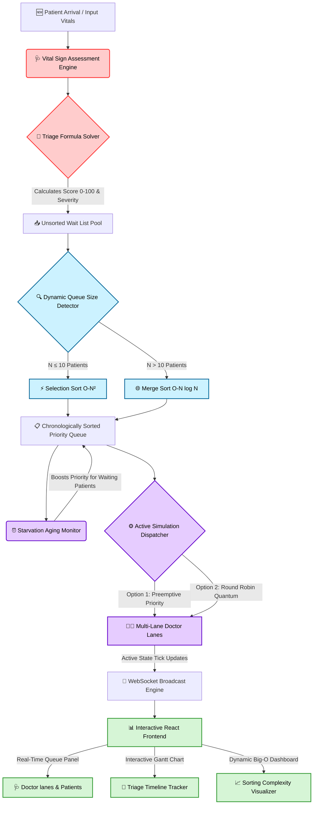

<div align="center">

# 🏥 PriorityPulse
### *Advanced Real-Time Hospital Emergency Room Triage & Scheduling Engine*

[](https://www.python.org/)
[](https://fastapi.tiangolo.com/)
[](https://react.dev/)
[](https://vitejs.dev/)
[](https://tailwindcss.com/)
[](https://developer.mozilla.org/en-US/docs/Web/API/WebSockets_API)

**An interactive multi-lane emergency room simulation platform bridging core Operating Systems (OS) scheduling policies with Design & Analysis of Algorithms (DAA) sorting paradigms.**

---

## 📖 Project Overview

**PriorityPulse** is a clinical emergency room simulation system. It models patients entering an ER queue as active CPU processes, calculating an algorithmic triage priority score from dynamic vital parameters (Heart Rate, Blood Pressure, Oxygen Saturation, and clinical symptom severity). The application serves as an educational and operational dashboard to observe and compare advanced computer science concepts:

*   **Design & Analysis of Algorithms (DAA):** Features a hybrid queue sorting controller that dynamically alternates between **Selection Sort ($O(n^2)$)** for smaller queues (to prevent recursion overhead) and **Merge Sort ($O(n \log n)$)** for larger triage pools. The frontend provides a live time-complexity tracing visualizer charting array comparisons, execution speeds, and memory allocations.
*   **Operating Systems (OS) Concepts:** Models patients as active process workloads mapped to CPU-like doctor lanes. Simulates **Preemptive Priority Scheduling** (where critical vitals immediately preempt active doctors) and **Round Robin (RR) Scheduling** (distributing time slices fairly with configurable time quantums). It also implements an **Aging Mechanism** to dynamically boost wait-list priorities and prevent starvation of lower-urgency patients.

---

## ⚡ Core Conceptual Mappings

PriorityPulse demonstrates the alignment between medical emergency operations, hardware schedulers, and sorting algorithms:

| Emergency Room Concept | Operating System (OS) Concept | Design & Analysis of Algorithms (DAA) |
| :--- | :--- | :--- |
| **Patient Profile** | Process Control Block (PCB) / Process | Data Structure Node / Object |
| **Clinical Vital Signs** | Process State & Resource Demands | Feature Vector / Mathematical Weights |
| **Triage Urgency Score** | Dynamic Process Priority | Sorting Key ($K$) |
| **Treatment Duration** | CPU Burst Time ($BT$) | Iterative Workload Duration |
| **Emergency Room Doctors** | CPU Core Lanes (Multi-core Scheduler) | Parallel Execution Pools |
| **Starvation Prevention** | Dynamic Process Aging Factor | Variable Priority Promotion |
| **Patient Preemption** | Interrupt Vector / Preemptive Context Swap | Queue Rescheduling |
| **Triage Sorting System** | Queue Management & Ready Queue State | Selection Sort vs. Merge Sort (Threshold-based) |

---

## 🗺️ System Pipeline & Architecture

The diagram below outlines the dynamic lifecycle of a patient, starting from vital analysis to sorting queue execution, dynamic aging, doctor lane assignments, and real-time state broadcasts:



---

## 🧮 Triage Scoring Formula & Mathematical Rationale

The dynamic Priority Score ($Score \in [0, 100]$) is calculated in [triage.py](file:///e:/ss/Prioritypulse/backend/core/triage.py) using a base rating, step-wise clinical deviations, and custom fine-grained tie-breakers to ensure unique rankings:

### 1. Base Score
$$Base = 15.0$$

### 2. Step-wise Clinical Deviations
*   **Heart Rate (HR) Deviation (Max $+18$):**
    $$\text{HR Score} = \begin{cases} +18 & \text{if } HR < 40 \text{ or } HR > 150 \text{ bpm (Critical Brady/Tachycardia)} \\ +10 & \text{if } 40 \le HR < 60 \text{ or } 120 < HR \le 150 \text{ bpm} \\ +5 & \text{if } 50 \le HR < 60 \text{ or } 100 < HR \le 120 \text{ bpm} \\ 0 & \text{otherwise (Normal range } 60 \text{--} 100 \text{ bpm)} \end{cases}$$
*   **Systolic Blood Pressure (SBP) Deviation (Max $+15$):**
    $$\text{SBP Score} = \begin{cases} +15 & \text{if } SBP < 80 \text{ or } SBP > 180 \text{ mmHg (Hypotension / Crisis)} \\ +8 & \text{if } 80 \le SBP < 90 \text{ or } 160 < SBP \le 180 \text{ mmHg} \\ +4 & \text{if } 90 \le SBP < 100 \text{ or } 140 < SBP \le 160 \text{ mmHg} \\ 0 & \text{otherwise} \end{cases}$$
*   **Oxygen Saturation ($SpO_2$) Saturation Drop (Max $+22$):**
    $$\text{SpO2 Score} = \begin{cases} +22 & \text{if } SpO_2 < 85\% \text{ (Severe Hypoxia)} \\ +15 & \text{if } 85\% \le SpO_2 < 90\% \\ +8 & \text{if } 90\% \le SpO_2 < 95\% \\ 0 & \text{otherwise (Normal } \ge 95\%) \end{cases}$$
*   **Symptom Weights (Max $+28$):**
    Derived dynamically from active chief symptoms:
    $$\text{Symptom Score} = \min(28, \text{Weight}_{\text{symptom}})$$
    *Key weights loaded in the vital matrix:*
    *   `stroke`: **$30$** | `chest_pain`: **$28$** | `breathing_difficulty`: **$25$**
    *   `allergic_reaction`: **$20$** | `abdominal_pain`: **$12$** | `fracture`: **$10$**
    *   `fever`: **$8$** | `laceration`: **$6$** | `headache`: **$4$** | `none`: **$0$**

### 3. Continuous Mathematical Tie-breakers
To eliminate priority score duplicates and guarantee a stable sorting order, the engine injects fractional calculations reflecting minor offsets from normal vitals:
$$Score_{\text{final}} = Base + \text{HR Score} + \text{SBP Score} + \text{SpO2 Score} + \text{Symptom Score} + \Phi$$
$$\text{Where } \Phi = (|HR - 80| \times 0.05) + (|SBP - 120| \times 0.03 + |DBP - 80| \times 0.02) + ((100.0 - SpO_2) \times 0.25) + (|Temp - 37.0| \times 0.5)$$

### 4. Severity Classifications
The final calculated score maps directly to professional severity indicators:
*   🔴 **CRITICAL** ($Score \ge 70.0$) - High risk of morbidity; immediate intervention.
*   🟠 **HIGH** ($Score \ge 45.0$) - Severe distress; prompt evaluation.
*   🟡 **MEDIUM** ($Score \ge 25.0$) - Semi-urgent status; minor anomalies.
*   🟢 **LOW** ($Score < 25.0$) - Non-urgent; stable status.

---

## 📊 Algorithmic & Scheduling Mechanics

### DAA Sorting Algorithm Performance
The simulation employs two primary sorting algorithms implemented from scratch in [sorting.py](file:///e:/ss/Prioritypulse/backend/core/sorting.py):

1.  **Selection Sort ($O(n^2)$):** Iteratively scans the array to lock in the highest-priority patient. This is chosen for small triage pools ($N \le 10$) to avoid recursive stack overhead.
2.  **Merge Sort ($O(n \log n)$):** A divide-and-conquer algorithm that recursively splits the triage queue and merges sorted subarrays. It scales efficiently to handle larger patient workloads ($N > 10$).

### OS Scheduling Policies
Both simulation paradigms run in the backend core orchestrator in [scheduler.py](file:///e:/ss/Prioritypulse/backend/core/scheduler.py):

*   **Preemptive Priority Scheduling:** The queue is sorted by triage urgency. A newly arrived patient with a higher priority immediately preempts (interrupts) a doctor treating a lower-priority patient. The preempted patient returns to the wait list, retaining their remaining treatment time.
*   **Round Robin (RR) Scheduling:** Doctors treat patients sequentially in fixed time slices (configurable quantum, e.g., $5$ minutes). Unfinished patients rotate to the back of the queue, ensuring fair treatment access.
*   **Starvation Prevention via Dynamic Aging:** In Priority mode, high-urgency patients can cause lower-urgency patients to wait indefinitely. The aging daemon [aging.py](file:///e:/ss/Prioritypulse/backend/core/aging.py) periodically inspects the queue. If a patient's wait time exceeds `AGING_THRESHOLD_MINUTES` ($15$ minutes), their Priority Score is bumped by `AGING_BOOST` ($10$ points) to prevent starvation.

---

## 🎨 Interactive Dashboard & Component Showcase

The frontend, built with React, Vite, and Tailwind CSS, is fully responsive:

*   🩺 **Patient Card (`PatientCard.jsx`):** Displays vital signs and computed priority metrics. It uses color-coded alert highlights and warning indicators for critical abnormalities.
*   📅 **Doctor Gantt Chart (`GanttChart.jsx`):** Rendered dynamically, this timeline charts each doctor lane. It visually details active treatment times, wait periods, and preemption swaps.
*   📈 **Complexity Panel (`ComplexityPanel.jsx`):** Compares theoretical sorting complexity with experimental runtimes. It includes dynamic visual charts plotting execution speeds in milliseconds.
*   ⚙️ **Simulation Controls (`SimControls.js`):** The dashboard interface for the simulation. It includes play, pause, single-step, speed sliders, and reset options.
*   🏥 **Queue Lanes (`QueuePanel.jsx`):** Organized vertical columns representing patient states: *Waiting*, *Treating*, and *Completed*.

---

## 📁 Codebase Directory Tree

Click on any highlighted file to navigate directly to its implementation:

```
Prioritypulse/
├── 📄 run_cli.py ────────────────── Standalone simulation runner & report compiler
├── 📄 triage_simulation_report.txt ─ Automatically generated static report
│
├── 📂 backend/ ──────────────────── FastAPI High-Performance ASGI Backend
│   ├── 📄 config.py ─────────────── Simulation constants, timeslices, and parameters
│   ├── 📄 main.py ───────────────── Application entry point & FastAPI setup
│   ├── 📄 requirements.txt ──────── Backend Python dependency requirements
│   │
│   ├── 📂 core/ ─────────────────── Simulation Core Algorithmic Engines
│   │   ├── 📄 aging.py ──────────── Low-priority starvation prevention & aging logic
│   │   ├── 📄 scheduler.py ──────── Preemptive Priority & Round Robin scheduler logic
│   │   ├── 📄 simulation.py ─────── Master simulation coordinator & state machine
│   │   ├── 📄 sorting.py ────────── Selection Sort & Merge Sort custom engines
│   │   └── 📄 triage.py ─────────── Vital scoring formula & clinical alerts matrix
│   │
│   ├── 📂 models/ ───────────────── Pydantic Data Validation Schemas
│   │   ├── 📄 patient.py ────────── Patient attributes, vitals, and process models
│   │   └── 📄 simulation.py ─────── State schemas, Gantt entries, and statistics
│   │
│   ├── 📂 routers/ ──────────────── REST Endpoints & WebSockets Handlers
│   │   ├── 📄 patients.py ──────── CRUD paths for patient records
│   │   ├── 📄 algorithms.py ────── Algorithms benchmarking endpoint
│   │   ├── 📄 simulation.py ────── Control mechanisms (start, step, reset)
│   │   └── 📄 ws.py ────────────── Real-time WebSocket state distribution
│   │
│   └── 📂 data/ ─────────────────── JSON Flat-File Storage Engines
│       ├── 📄 patients.json ────── Active database patients file
│       └── 📄 seed_patients.json ── Prepopulated clinical sample dataset
│
└── 📂 frontend/ ─────────────────── React Single Page Application (Vite + Tailwind)
    ├── 📄 package.json ──────────── Package details & UI dependency requirements
    ├── 📄 vite.config.js ────────── Vite bundler pipeline configuration
    │
    └── 📂 src/
        ├── 📄 App.jsx ───────────── Root component layout & state router
        ├── 📄 index.css ─────────── Design tokens & Tailwind styling definitions
        │
        ├── 📂 components/ ───────── Modular Dashboard Elements
        │   ├── 📂 AddPatientForm/ ── Form for adding patients mid-simulation
        │   ├── 📂 AlgoComparison/ ── Live sorting benchmarking dashboard
        │   ├── 📂 ComplexityPanel/ ─ Big-O visual performance panel
        │   ├── 📂 GanttChart/ ────── Doctor scheduling Gantt timeline tracker
        │   ├── 📂 PatientCard/ ───── Vitals card & visual alert status
        │   ├── 📂 QueuePanel/ ────── Treatment state column lanes
        │   ├── 📂 SimControls/ ──── Simulation playback system controls
        │   └── 📂 StatsPanel/ ───── Key metrics (Turnaround, Wait times, Throughput)
        │
        └── 📂 api/ ──────────────── Axios service wrappers & WebSocket channels
```

---

## 🔌 API & WebSocket Reference

The backend provides a RESTful API and a real-time WebSocket server:

### REST API Endpoints

| Method | Endpoint | Description | Request / Response Payload |
| :---: | :--- | :--- | :--- |
| **`GET`** | `/api/patients` | Retrieve all patients with computed priority scores | Returns a list of patient objects |
| **`POST`** | `/api/patients` | Add a new patient mid-simulation | Expects vitals data. Automatically calculates scores |
| **`GET`** | `/api/simulation/state` | Retrieve the active simulation state | Current clock, queue status, Gantt chart data, and metrics |
| **`POST`** | `/api/simulation/start` | Start or resume the simulation | Launches the automated scheduler tick timer |
| **`POST`** | `/api/simulation/pause` | Pause the active simulation tick timer | Halts the clock |
| **`POST`** | `/api/simulation/step` | Advance the simulation clock by 1 minute | Runs a single scheduler iteration |
| **`POST`** | `/api/simulation/reset` | Reset simulation state to initial parameters | Restores patient values to seed configuration |
| **`POST`** | `/api/algorithms/compare` | Compare Selection and Merge Sort performance | Returns execution time, comparisons, and swap lists |

### WebSocket Broadcast Channel

*   **Endpoint:** `ws://localhost:8000/ws/simulation`
*   **Frequency:** Broadcasts on every clock increment, vital modification, or patient addition.
*   **Data Payload Structure:**
    ```json
    {
      "clock": 14,
      "scheduler_type": "priority",
      "patients": [ ... ],
      "active_queue": [ ... ],
      "gantt_chart": [ ... ],
      "stats": {
        "avg_waiting_time": 6.8,
        "avg_turnaround_time": 14.2,
        "throughput": 4
      }
    }
    ```

---

## 🛠️ Quick Start & Developer Setup

Ensure you have **Python 3.11** and **Node.js 18+** installed before proceeding.

### 1. Clone & Prepare the Environment
```bash
# Clone the repository
git clone https://github.com/your-username/Prioritypulse.git
cd Prioritypulse
```

### 2. Launch the Backend Server
```bash
# Navigate to the backend folder
cd backend

# Create and activate a virtual environment
# On macOS/Linux:
python3 -m venv venv && source venv/bin/activate
# On Windows:
python -m venv venv && venv\Scripts\activate

# Install backend dependencies
pip install -r requirements.txt

# Start the development server
uvicorn main:app --reload --port 8000
```
*   The API service is accessible at **`http://localhost:8000`**
*   The Swagger API documentation is available at **`http://localhost:8000/docs`**

### 3. Launch the Frontend Interface
```bash
# Open a new terminal window or tab and go to the frontend directory
cd frontend

# Install UI dependencies
npm install

# Start the Vite bundler development server
npm run dev
```
*   Open your browser to **`http://localhost:5173`** to access the dashboard.

---

## 🧪 Running the Standalone Simulation CLI

PriorityPulse includes a standalone terminal runner that executes the entire sorting and scheduling simulation. It outputs formatted tables and ASCII charts directly to your terminal and saves a report to the workspace.

To run the standalone terminal simulator:
```bash
# Run from the root directory
python run_cli.py
```

### Generated Simulation Report
The CLI automatically compiles the simulation results into [triage_simulation_report.txt](file:///e:/ss/Prioritypulse/triage_simulation_report.txt). The output contains:
1.  **Patient Demographics & Vitals Table:** Complete list of processed patients, vitals, and computed clinical metrics.
2.  **DAA Sorting Benchmarks:** Selection Sort and Merge Sort comparisons.
3.  **Preemptive Priority Simulation Log:** Real-time event log tracking arrivals, preemptions, completions, and aging boosts.
4.  **Round Robin Simulation Log:** Step-by-step event tracker detailing time-sliced treatment intervals.
5.  **Multi-Lane Gantt Timeline:** Graphical ASCII timelines tracking scheduling blocks for each doctor lane.

---

## ⚙️ Customizing Simulation Parameters

You can adjust the simulation variables by editing [backend/config.py](file:///e:/ss/Prioritypulse/backend/config.py):

```python
ROUND_ROBIN_QUANTUM = 5          # Duration of the treatment slice (in minutes)
AGING_THRESHOLD_MINUTES = 15     # Patient wait time threshold before triggering a priority boost
AGING_BOOST = 10                 # Priority score points added when a patient exceeds the wait threshold
NUM_DOCTORS = 2                  # Number of active doctor scheduling lanes (1 - 5)
SORT_LARGE_THRESHOLD = 10        # Queue size threshold to alternate from Selection Sort to Merge Sort
```

---

<div align="center">

**PriorityPulse: Engineered with clinical precision and algorithmic rigour.**  
*Bridging Design & Analysis of Algorithms with Operating Systems Core Paradigms.*

</div>