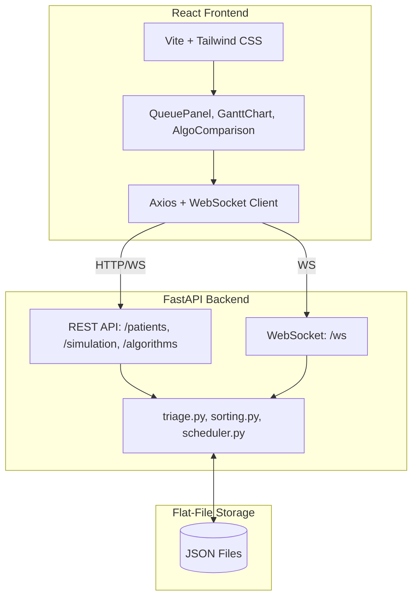

<div align="center">
  <h1>🏥 PriorityPulse</h1>
  <p><strong>A Modern Hospital Triage & OS Scheduling Simulator</strong></p>

  <p>
    
    
    
    
    
  </p>

  <p>
    <em>A sophisticated simulation bridging the gap between Operating Systems algorithms and Emergency Room triage systems.</em>
  </p>
</div>

---

## ✨ Overview

**PriorityPulse** is a dynamic simulation application that models an Emergency Room (ER) queue. It uniquely applies core concepts from **Operating Systems (OS)** and **Design and Analysis of Algorithms (DAA)** to solve real-world patient prioritization. 

Patients arrive with vital signs (heart rate, blood pressure, oxygen saturation, symptoms), and a triage score is automatically calculated. The queue is continuously re-sorted and scheduled to ensure the most critical patients receive immediate care.

---

## 🚀 Key Features

### 🧮 Algorithmic Intelligence
- **Dynamic Sorting:** Uses **Selection Sort (O(n²))** for small queues (≤ 10) and **Merge Sort (O(n log n))** for larger queues, optimizing performance based on load.
- **Complexity Analysis:** Live Big-O analysis and runtime comparison between sorting algorithms.

### ⚙️ Operating System Concepts
- **Process Modeling:** Patients are modeled as OS processes with `PID`, `Arrival Time (AT)`, `Burst Time (BT)`, and `Priority`.
- **Preemptive Priority Scheduling:** The most critical patient is always treated next.
- **Round Robin:** Time-slicing (quantum = 5 min) ensures fair doctor time distribution.
- **Aging Mechanism (Bonus):** Prevents starvation by boosting priority for low-priority patients waiting over 15 minutes.

### 💻 Interactive Dashboard
- **Live Queue:** Real-time visualization of waiting, treating, and completed patients.
- **Gantt Charts:** Interactive, per-doctor scheduling visualization.
- **Dynamic Influx:** Add new patients mid-simulation with live WebSocket updates and arrival animations.

---

## 🏗️ Architecture

PriorityPulse uses a modern, decoupled architecture communicating via HTTP and WebSockets.



---

## 🛠️ Quick Start

> **Prerequisites:** Python 3.11+, Node.js 18+

### 1️⃣ Start the Backend
```bash
cd backend

# Create and activate virtual environment
python -m venv venv
source venv/bin/activate  # On Windows: venv\Scripts\activate

# Install dependencies and run
pip install -r requirements.txt
uvicorn main:app --reload --port 8000
```
*API running at [http://localhost:8000](http://localhost:8000)* | *Swagger UI at [http://localhost:8000/docs](http://localhost:8000/docs)*

### 2️⃣ Start the Frontend
```bash
cd frontend

# Install dependencies and run
npm install
npm run dev
```
*App running at [http://localhost:5173](http://localhost:5173)*

---

## 🔌 API Reference

| Method | Endpoint | Description |
| :--- | :--- | :--- |
| `GET` | `/patients` | List all patients with computed scores |
| `POST` | `/patients` | Add a new patient |
| `GET` | `/simulation/state` | Current clock, queue, Gantt, and stats |
| `POST` | `/simulation/start` | Begin simulation |
| `POST` | `/simulation/pause` | Pause at current tick |
| `POST` | `/simulation/step` | Advance one tick |
| `POST` | `/simulation/reset` | Reset to initial state |
| `POST` | `/algorithms/compare` | Run algorithm comparisons |
| `WS` | `/ws/simulation` | Real-time state broadcast |

---

## ⚙️ Configuration

No `.env` file is required. Core settings are adjustable in `backend/config.py`:

```python
ROUND_ROBIN_QUANTUM = 5          # Minutes per time slice
AGING_THRESHOLD_MINUTES = 15     # Wait time before priority bump
AGING_BOOST = 10                 # Points added per threshold exceeded
NUM_DOCTORS = 1                  # Default doctor count (1–5)
SORT_LARGE_THRESHOLD = 10        # Threshold to switch to Merge Sort
```

---

## 📚 Documentation

Deep dive into the academic concepts and technical implementation:

- 📘 [**DAA Analysis**](docs/DAA_analysis.md): Selection Sort vs Merge Sort derivations, proofs, and triage rationale.
- 📙 [**OS Concepts**](docs/OS_concepts.md): Process modeling, scheduling algorithms, metrics, and a 5-patient worked example.
- 📗 [**Demo Walkthrough**](docs/demo_walkthrough.md): Step-by-step run guide, expected UI states, and troubleshooting.

---
<div align="center">
  <i>Built with ❤️ as part of a DAA + OS academic project.</i>
</div>